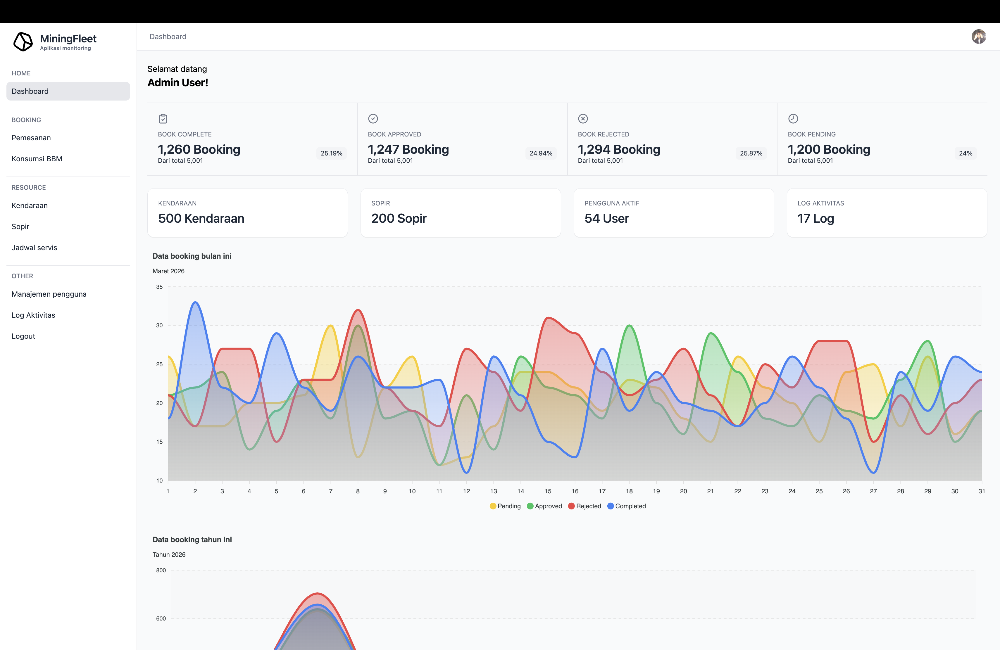

# MiningFleet (Aplikasi monitoring kendaraan tambang)


## 1. Deskripsi
Aplikasi ini digunakan untuk memonitoring dan memanajemen pemakaian kendaraan perusahaan.  
Fitur utama:

- Booking kendaraan oleh admin atau pegawai
- Approval berjenjang (Supervisor → Manager)
- Input konsumsi BBM setelah perjalanan
- Dashboard penggunaan kendaraan
- Laporan periodik & export Excel
- Log aktivitas setiap aksi penting

---

## 2. User & Login

| Role       | Email                    | Password   |
|------------|--------------------------|------------|
| Admin      | [a@admin.com]            | admin      |
| Employee   | [a@employee.com]         | employee   |
| Supervisor | [a@supervisor.com]       | supervisor |
| Manager    | [a@manager.com]          | manager    |

1. Buka halaman login aplikasi
2. Masukkan email dan password sesuai tabel di atas
3. Sistem akan mengarahkan user ke dashboard sesuai role masing-masing

---

## 3. Teknologi & Versi

| Komponen       | Versi / Info                    |
|----------------|---------------------------------|
| PHP            | 8.5.2                           |
| Database       | PostgreSQL 18.2                 |
| Framework      | Laravel 12.22                   |
| Frontend       | Blade / TailwindCSS / HTML5     |
| Excel Export   | maatwebsite/excel               |

---

## 4. Struktur Database (Ringkas)

Tabel utama:

- `users` → menampung admin, supervisor, manager  
- `vehicles` → data kendaraan  
- `bookings` → data pemesanan kendaraan  
- `approvals` → approval berjenjang  
- `fuel_logs` → catatan konsumsi BBM  
- `vehicle_services` → catatan service kendaraan  
- `logs` → catatan aktivitas sistem  

---

## 5. Panduan Penggunaan Aplikasi

Panduan berikut menjelaskan cara menggunakan sistem berdasarkan role pengguna.

---

# Admin

**Deskripsi**
Admin bertanggung jawab untuk mengelola data kendaraan, driver, jadwal servis, serta membuat pemesanan kendaraan.

**Fitur yang tersedia**

* Mengelola data kendaraan
* Mengelola data driver
* Mengelola jadwal servis kendaraan
* Export laporan periodik
* Membuat pemesanan kendaraan
* Menentukan driver
* Menentukan pihak yang menyetujui (Supervisor dan Manager)
* Melihat status pemesanan kendaraan
* Menginput konsumsi BBM

**Langkah Penggunaan**

1. Login ke sistem menggunakan akun Admin.
2. Buka menu **Pemesanan**.
3. Klik **Tambah Pesanan**.
4. Pilih kendaraan yang tersedia.
5. Pilih driver yang akan mengemudikan kendaraan.
6. Masukkan tujuan perjalanan.
7. Tentukan tanggal mulai dan tanggal selesai.
8. Pilih **Supervisor dan Manager** sebagai pihak yang menyetujui.
9. Simpan data booking.
10. Sistem akan mengirimkan permintaan persetujuan ke Supervisor & Manager.

---

# Employee

**Deskripsi**
Employee bertanggung jawab untuk melakukan input pemesanan kendaraan

**Fitur yang tersedia**

* Membuat data pemesanan kendaraan
* Melihat status persetujuan pemesanan
* Melihat riwayat penggunaan kendaraan

**Langkah Penggunaan**

1. Login ke sistem menggunakan akun Employee.
2. Buka menu **Pemesanan**.
3. Klik **Tambah Pesanan**.
4. Pilih kendaraan yang tersedia.
5. Pilih driver yang akan mengemudikan kendaraan.
6. Masukkan tujuan perjalanan.
7. Tentukan tanggal mulai dan tanggal selesai.
8. Pilih **Supervisor dan Manager** sebagai pihak yang menyetujui.
9. Simpan data booking.
10. Sistem akan mengirimkan permintaan persetujuan ke Supervisor & Manager.

---

# Supervisor

**Deskripsi**
Supervisor bertanggung jawab melakukan **persetujuan level pertama** terhadap pemesanan kendaraan.

**Fitur yang tersedia**

* Melihat daftar pemesanan yang menunggu persetujuan
* Menyetujui pemesanan kendaraan
* Menolak pemesanan kendaraan
* Melihat riwayat persetujuan

**Langkah Penggunaan**

1. Login ke sistem menggunakan akun Supervisor.
2. Buka menu **Persetujuan**.
3. Sistem akan menampilkan daftar booking yang menunggu persetujuan.
4. Periksa detail pemesanan kendaraan.
5. Pilih salah satu aksi:

   * **Approve** untuk menyetujui booking.
   * **Reject** untuk menolak booking.
6. Jika disetujui, maka booking akan diteruskan ke **Manager** untuk persetujuan berikutnya.

---

# Manager

**Deskripsi**
Manager bertanggung jawab melakukan **persetujuan level kedua** terhadap pemesanan kendaraan.

**Fitur yang tersedia**

* Melihat daftar booking yang sudah disetujui oleh Supervisor
* Menyetujui pemesanan kendaraan
* Menolak pemesanan kendaraan
* Melihat riwayat persetujuan

**Langkah Penggunaan**

1. Login ke sistem menggunakan akun Manager.
2. Buka menu **Persetujuan**.
3. Sistem akan menampilkan booking yang sudah disetujui oleh Supervisor.
4. Periksa detail pemesanan kendaraan.
5. Pilih salah satu aksi:

   * **Approve** untuk menyetujui booking.
   * **Reject** untuk menolak booking.
6. Jika Manager menyetujui booking, maka status booking berubah menjadi **Approved** dan kendaraan dapat digunakan.

---

# Alur Kerja Sistem

Berikut adalah alur proses pemesanan kendaraan dalam sistem.

1. Admin/Pegawai membuat pemesanan kendaraan.
2. Sistem menyimpan data booking dengan status **Pending Approval**.
3. Supervisor melakukan persetujuan level pertama.
4. Jika Supervisor menolak, maka booking berstatus **Rejected**.
5. Jika Supervisor menyetujui, maka booking diteruskan ke Manager.
6. Manager melakukan persetujuan level kedua.
7. Jika Manager menolak, maka booking berstatus **Rejected**.
8. Jika Manager menyetujui, maka booking berstatus **Approved**.
9. Kendaraan dapat digunakan oleh pegawai.
10. Admin/Pegawai menginput data konsumsi BBM.
10. Setelah input konsumsi BBM selesai, selesaikan pesanan
11. Status booking berubah menjadi **Completed**.


---

## 6. Panduan Instalasi

Ikuti langkah berikut untuk menjalankan aplikasi di lingkungan lokal.

1. Clone Repository

Clone project dari repository:

```bash
git clone <repository-url>
cd <project-folder>
```

2. Install Dependency

Install semua dependency PHP menggunakan Composer:

```bash
composer install
```

Install dependency frontend (jika menggunakan Vite / npm):

```bash
npm install
npm run dev
```

3. Konfigurasi Environment

Salin file `.env.example` menjadi `.env`:

```bash
cp .env.example .env
```

Generate application key:

```bash
php artisan key:generate
```

4. Konfigurasi Database (PostgreSQL)

Edit file `.env` dan sesuaikan konfigurasi database:

```
DB_CONNECTION=pgsql
DB_HOST=127.0.0.1
DB_PORT=5432
DB_DATABASE=mining_fleet
DB_USERNAME=postgres
DB_PASSWORD=your_password
```

Pastikan database **mining_fleet** sudah dibuat di PostgreSQL.

5. Migrasi dan Seeder Database

Jalankan migration dan seeder untuk membuat tabel dan data awal:

```bash
php artisan migrate --seed
```

Seeder akan membuat beberapa user untuk login ke aplikasi.

6. Jalankan Server

Jalankan server Laravel:

```bash
php artisan serve
```

Aplikasi dapat diakses melalui browser:

```
http://127.0.0.1:8000
```

### 7. Login ke Aplikasi

Gunakan akun yang tersedia pada bagian **User & Login** di README untuk masuk ke sistem.
